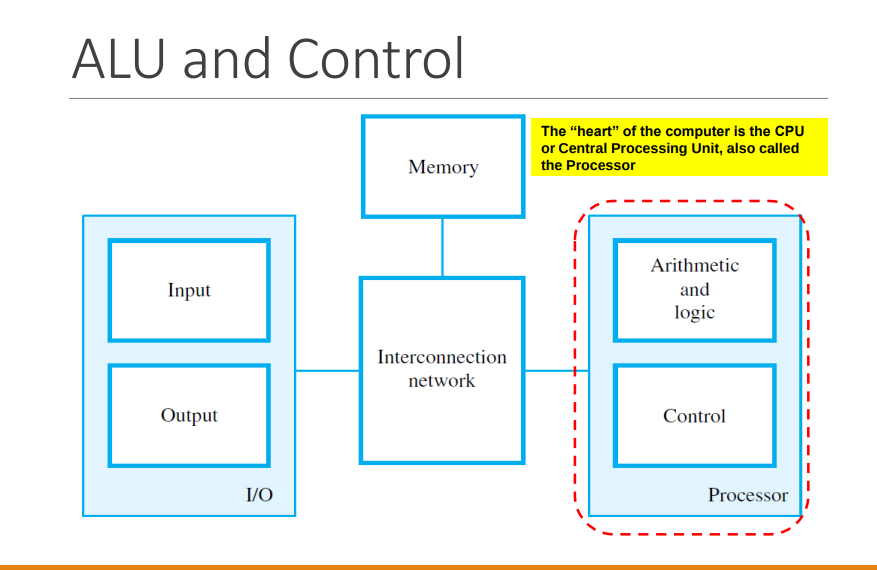
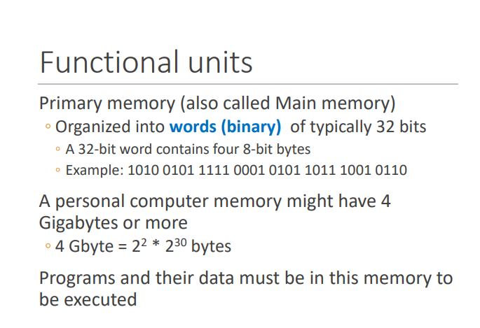
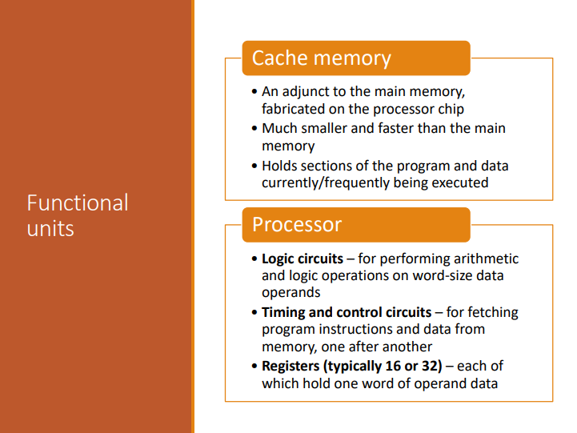
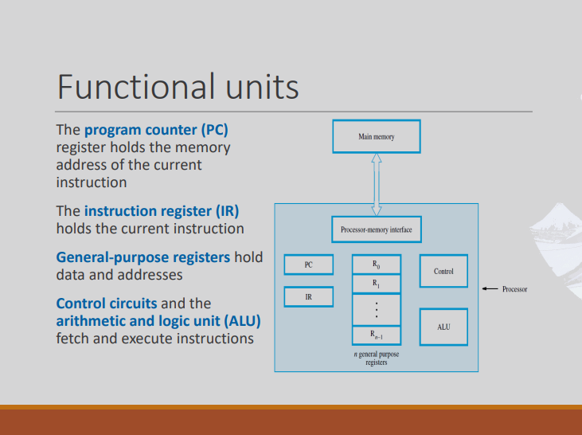
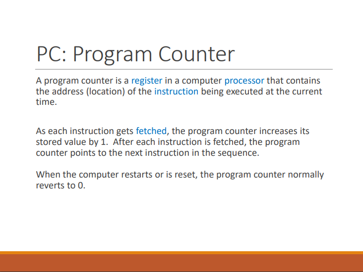
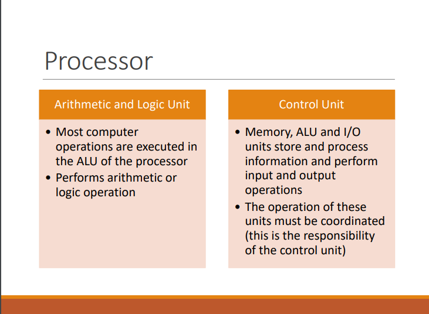
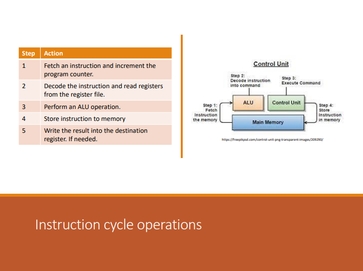
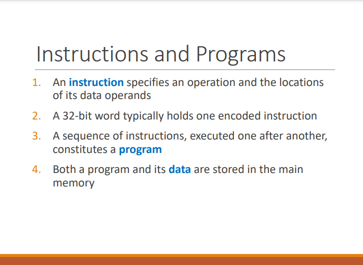
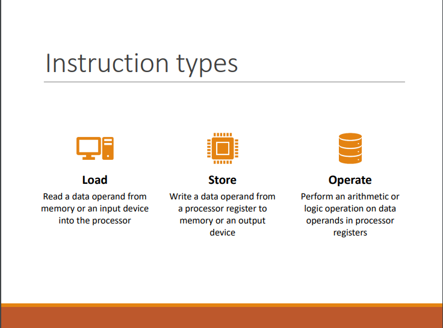

# Topic 1B Network Devices

## ALU and Control
 
## Functional Units
 
 
 
 
## Processor
 
## Operations of a computer
 
## Instruction Cycle Operations
 
 
 
## LMC (videos)
[here](https://www.youtube.com/watch?v=9AWN_ntHfPk) 