# Topic 3 Introduction to Computer Network:

## Network Components (Hardware and Software)
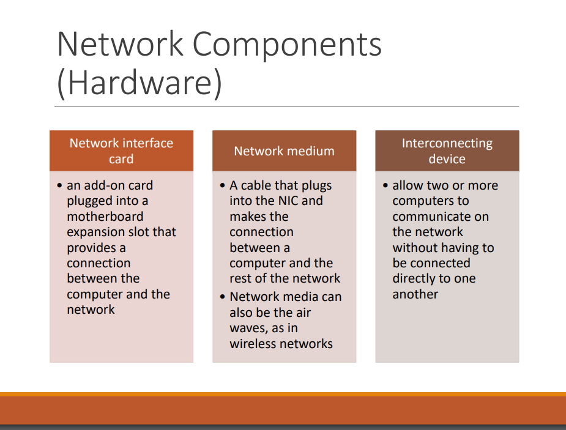 
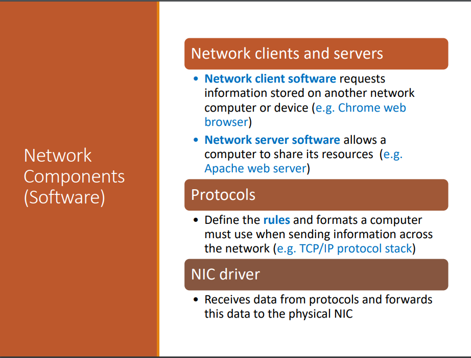 
## Layers of the Network Communication Process
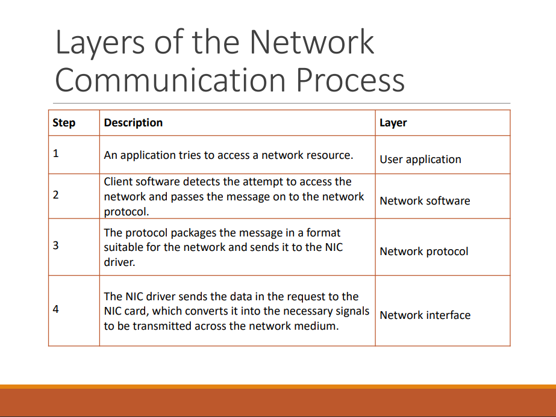 
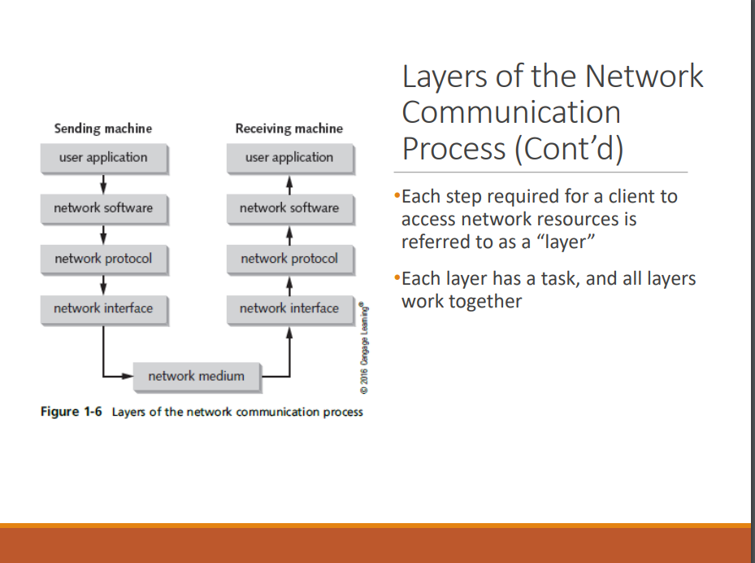 
## How two computers communicate on a LAN
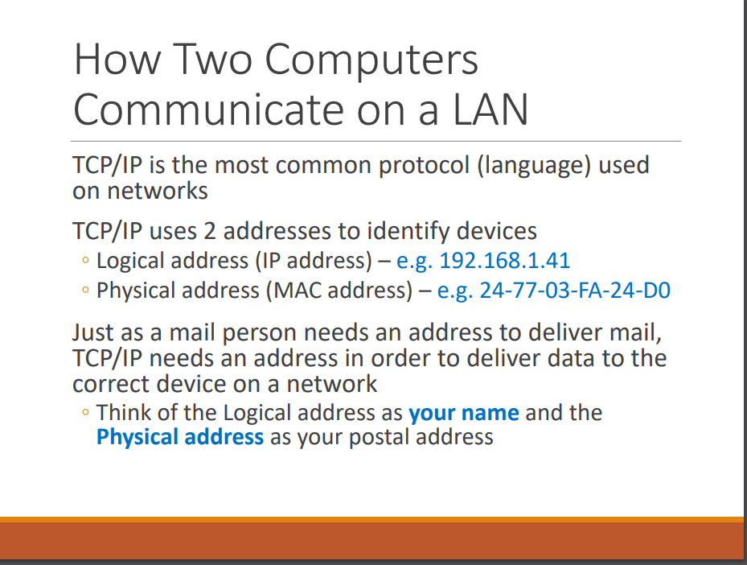 
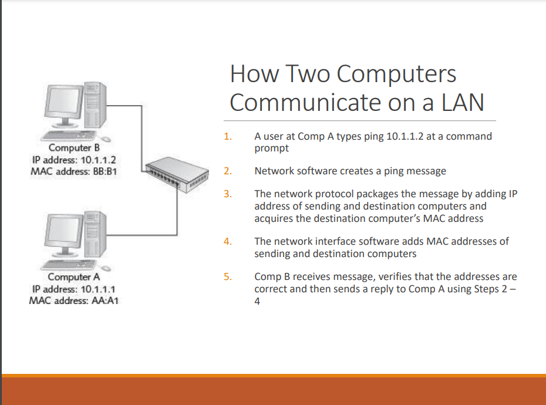 
## What are LANs, Internetworks, WANs and MANs
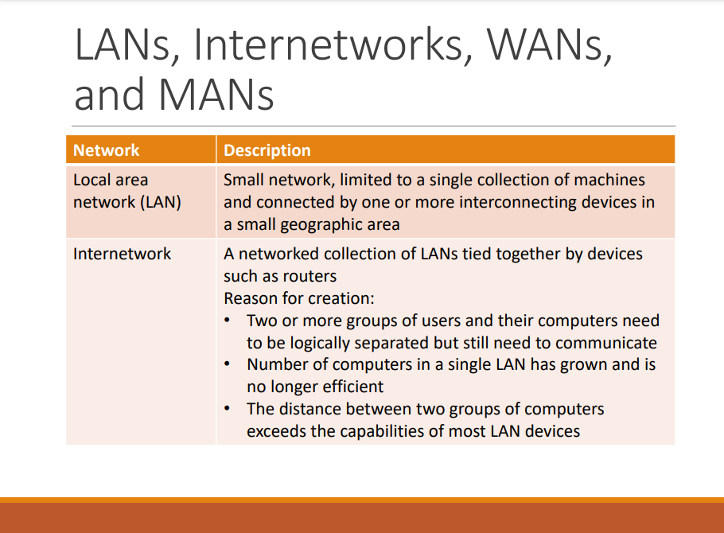 
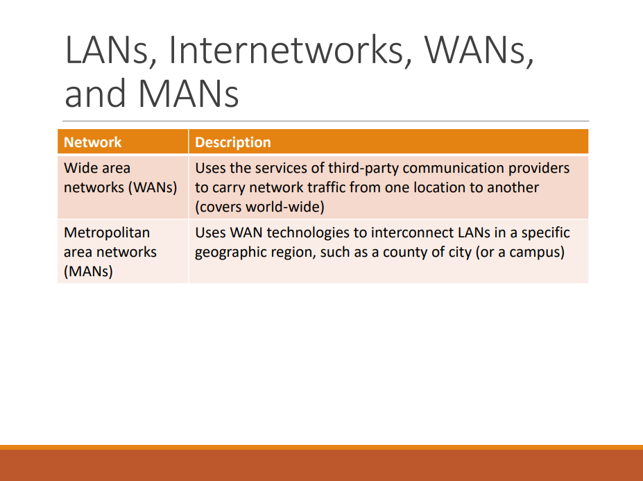 
## What are the LANs private IP addresses
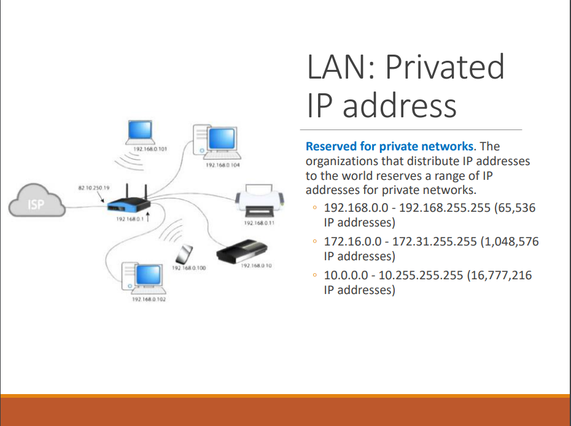 
## How packets travel in a network
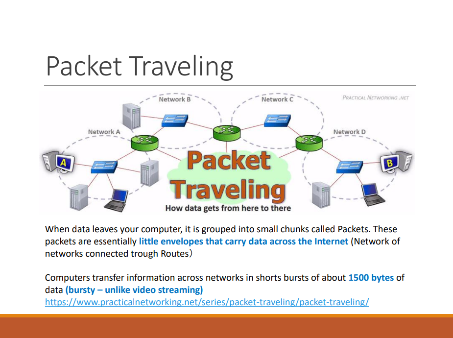 
## What is a packet and frame
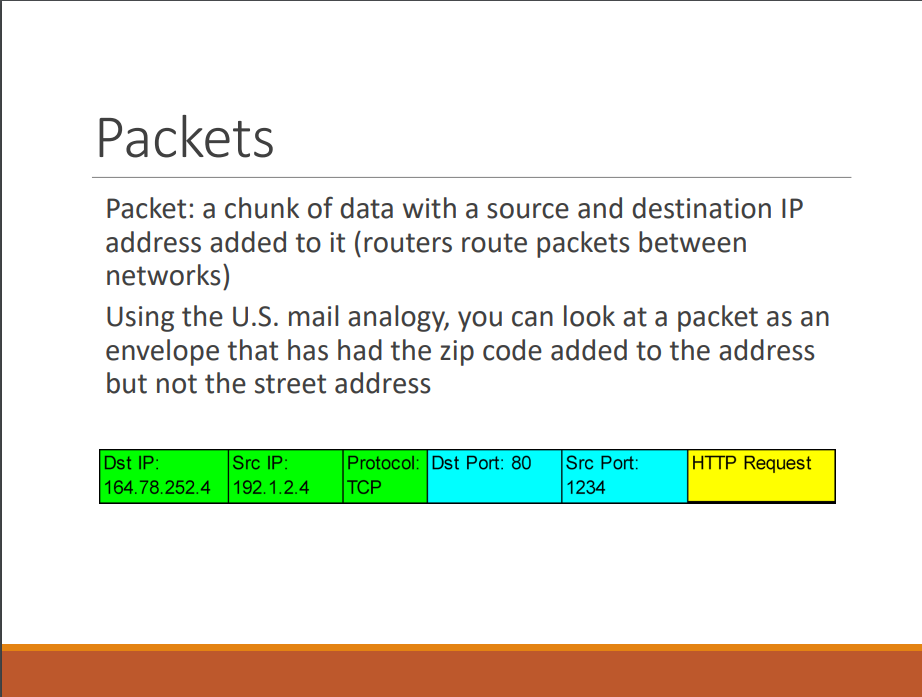 
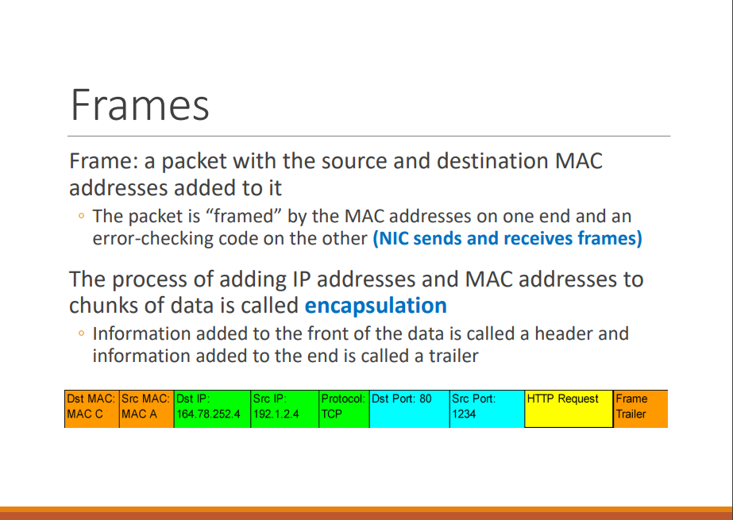 
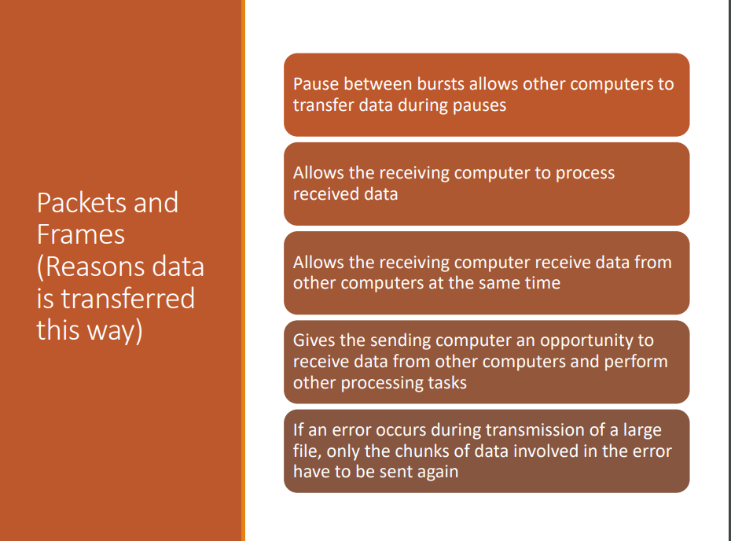 
## CIDR Notation and calculation
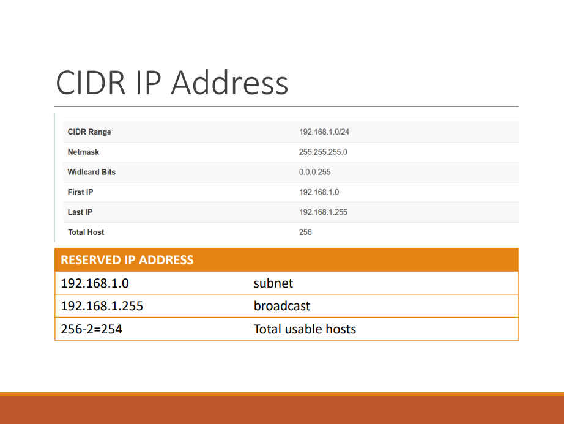 