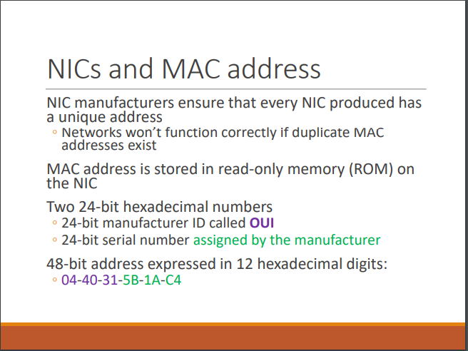
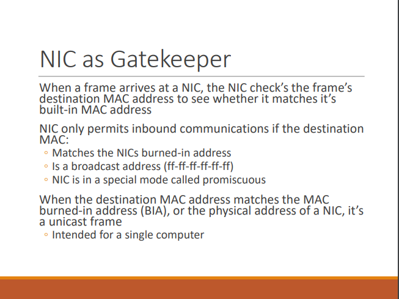
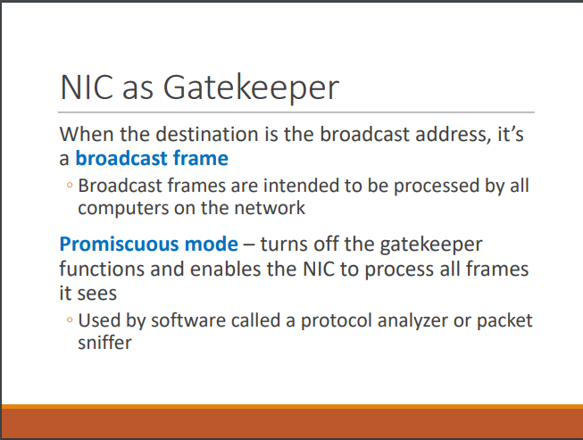
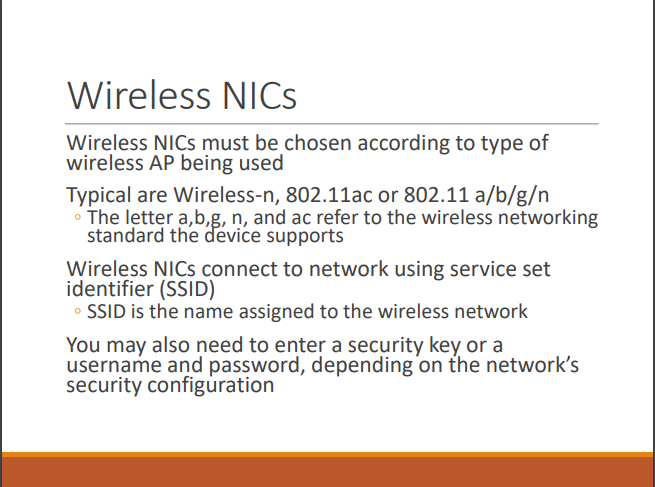
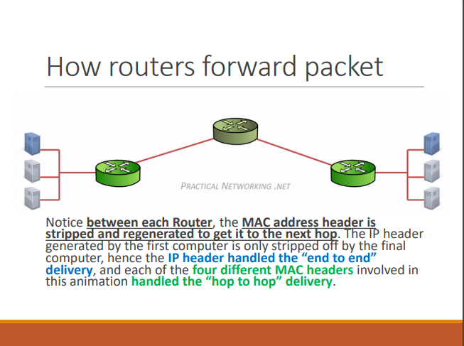

# Topic 4 Network Devices

## Duplex:
Half-duplex is when data can only go in one direction at a time. Full-duplex is when data can flow in both directions at the same time. 
## What is a repeater:
(yes it is not needed in accordance to the question tips but it is relevant to hubs) 
- A repeater receives bit signals generated by NICs and other devices, strengthens them, and then "repeat" them to other parts of the network.
- A repeater enables you to connect computers whose distance from one another would make communication impossible.
- A traditional repeater has 2 ports or connection that you can use to extend your network.

## Multiport Repeaters and Hubs:
- Referred as Hub
- Receives bit signals generated from a connected computer's NIC on one of its ports
- Cleans the signal by filtering out electrical noise
- Regenerates the signal to full strength
- Transmits the regenerated signal to all other ports where a computer (or other network device is connected to)

## What is a hub-switch-router:
| Characteristic | Hubs | Switches | Routers |
|----------------|------|----------|---------|
| intelligence | false | true | true |
| duplex | half | full | full |
| bandwidth | divided across all | dedicated bandwidth | dedicated bandwidth |
| data destination | all | only to specified MAC address in frame | only to specified IP address specified in packet |
| table type | none | switching | routing |
| info type | none | frame | packet |
| address type | none | mac (physical) | IP (logical) |
| internet | cannot provide internet connection (only interconnects computers) | cannot provide internet connection (only interconnects computers) | can provide a connection |
| broadcast | yes | forwards broadcasts | no |
| use | create networks (LANs) | create networks (LANs) | connect networks (LANs) |
| Additional Remarks | As the hub duplicates the data frame across all ports, it wastes bandwidth and creates security risks. | Has a set of operations to determine destination, this is done so by the switch learning the mac addresses of all connected devices and storing them in a table (switching table). | Gets packet, inspects it, checks if the ip address matches to the packet to see if the packet was intended for the router's network or another. If it ain't for the router's network, the packet s sent away |

## Switch Operations:
- Data is sent onto the medium one frame at a time
- Each frame has the destination and source MAC address
- Switch reads the address
	- Uses the source MAC address of frame to keep a record of which computer is which port (switching table)
	- Forwards the frame to the port where the destination MAC can be found.

## Switch Ops step-by-step:
1. receives frame
2. reads sources and destination MAC address
3. looks up the destination MAC address in its switching table
4. forwards the frame to the port where the computer owning the MAC address is found
5. the switching table is updated with the source MAC address and port information

## What is a Wireless Access Point (WAP)
- The heart of a wireless network is the wireless access point (AP)
- APs operate similarly to a hub without wires
- All communication passes through the AP
- Most small business and home networks typically called a wireless router that combines an AP, switch and a router
- Wireless LANs are usually attacked to wired networks

## What is a NIC
- Provides a connection from computer to medium
- Incoming messages: recieves bit signals and assembles them into frames
	- verifies the destination address
	- removes the frame header and sends the resulting packet to the network protocol
- Outgoing messages: receives packet from network protocol
	- creates frame by adding MAC address/error check
	- converts frame to bit signals suitable for the medium and transmits them

## multicast-broadcast-unicast
| broadcast | unicast | multicast |
|-----------|---------|-----------|
| to all parties | to only one party | multiple (maybe not all) parties |

## extra info (may come out)
 
 
 
 
 